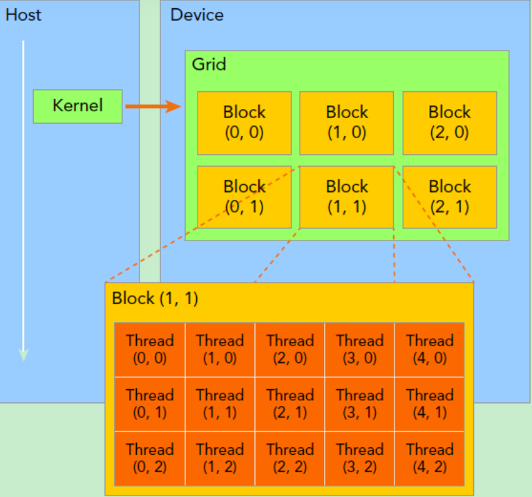
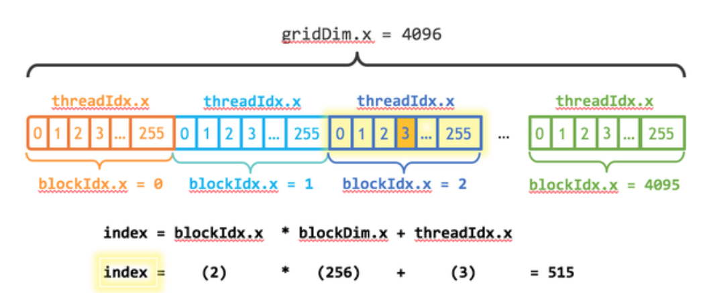
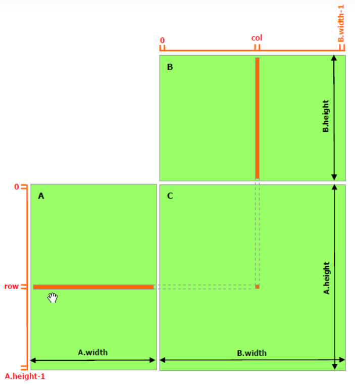

# CUDA Learning Log

## 2024-10-29

### CUDA program pipeline
1. malloc host memory + init data
2. malloc device memory + transfer data from host to device
3. launch **kernel** to compute(kernel function + grid size + block size)
4. transfer data from device to host
5. free memory

### CUDA Kernel

#### Basic
1. What is kernel function?
    Kernel function is **parallel function** running on **GPU**.
2. How to write kernel function?
    ```cpp
    __global__ void kernelFunction(parameters){

    }
    ```
    kernel functions are defined with `__global__` keyword with viod return.
3. How to launch kernel function?
    ```cpp
    kernelFunction<<<gridSize, blockSize>>>(parameters);
    ```
    Use `<<<gridSize, blockSize>>>` to define excution threads.
    Every thread has a unique ID within the grid and block.

#### Kernel Function Thread Structure
 
grid -> block -> thread
Gird and block are 2-D thread structure, but they can be defined as 1-D or 3-D, which initiate the missing dimensions by default 1.



```cpp
dim3 grid(3, 2);
dim3 block(5, 3);
kernel_fun<<< grid, block >>>(prams...);
```
#### How to set suitable grid and block size?
Thread is running on GPU, so the size of grid and block should be considered with GPU's capability.

Every thread is excuted on one streaming multiprocessor(SM), so the size of grid and block should be considered with GPU's SM number and threads per SM.
```cpp
int dev = 0;
cudaDeviceProp devProp;
CHECK(cudaGetDeviceProperties(&devProp, dev));
std::cout << "use GPU device " << dev << ": " << devProp.name << std::endl;
std::cout << "SM number：" << devProp.multiProcessorCount << std::endl;
std::cout << "shared memory size per block：" << devProp.sharedMemPerBlock / 1024.0 << " KB" << std::endl;
std::cout << "max threads per block：" << devProp.maxThreadsPerBlock << std::endl;
std::cout << "max threads per EM：" << devProp.maxThreadsPerMultiProcessor << std::endl;
std::cout << "max threads per SM：" << devProp.maxThreadsPerMultiProcessor / 32 << std::endl;
```
```cpp
// output
use GPU device 0: GeForce GT 730
SM number：2
shared memory size per block：48 KB
max threads per block：1024
max threads per EM：2048
max threads per SM：64
```
#### Example1: Matrix Addition
Use one thread to compute one element in output matrix Z, define a kernel function to add two vectors.
```cpp
#include <iostream>
#include <cuda_runtime.h>
#include <cmath>

__global__ void add(float* x, float* y, float* z, int N)
{
    int index = threadIdx.x + blockIdx.x * blockDim.x;
    if (index < N) {
        z[index] = x[index] + y[index];
    }
}
```
main function to launch kernel function.
```cpp
int main()
{
    int N = 1 << 20;
    int nBytes = N * sizeof(float);
    // 申请host内存
    float *x, *y, *z;
    x = (float*)malloc(nBytes);
    y = (float*)malloc(nBytes);
    z = (float*)malloc(nBytes);

    // 初始化数据
    for (int i = 0; i < N; ++i)
    {
        x[i] = 10.0;
        y[i] = 20.0;
    }

    // 申请device内存
    float *d_x, *d_y, *d_z;
    cudaMalloc((void**)&d_x, nBytes);
    cudaMalloc((void**)&d_y, nBytes);
    cudaMalloc((void**)&d_z, nBytes);

    // 将host数据拷贝到device
    cudaMemcpy((void*)d_x, (void*)x, nBytes, cudaMemcpyHostToDevice);
    cudaMemcpy((void*)d_y, (void*)y, nBytes, cudaMemcpyHostToDevice);
    // 定义kernel的执行配置
    dim3 blockSize(256);
    dim3 gridSize((N + blockSize.x - 1) / blockSize.x);
    // 执行kernel
    add << < gridSize, blockSize >> >(d_x, d_y, d_z, N);

    // 将device得到的结果拷贝到host
    cudaMemcpy((void*)z, (void*)d_z, nBytes, cudaMemcpyDeviceToHost);

    // 检查执行结果
    float maxError = 0.0;
    for (int i = 0; i < N; i++)
        maxError = fmax(maxError, fabs(z[i] - 30.0));
    std::cout << "最大误差: " << maxError << std::endl;

    // 释放device内存
    cudaFree(d_x);
    cudaFree(d_y);
    cudaFree(d_z);
    // 释放host内存
    free(x);
    free(y);
    free(z);

    return 0;
}
```


- Improvment:
    - Use `cudaMallocManaged` to manage memory, which can automatically transfer data between host and device.
    - Use `cudaDeviceSynchronize` to wait for kernel function to finish.
    - Use `cudaGetLastError` to check if there is an error in the kernel function.
```cpp
int main()
{
    int N = 1 << 20;
    int nBytes = N * sizeof(float);

    // 申请托管内存
    float *x, *y, *z;
    cudaMallocManaged((void**)&x, nBytes);
    cudaMallocManaged((void**)&y, nBytes);
    cudaMallocManaged((void**)&z, nBytes);

    // 初始化数据
    for (int i = 0; i < N; ++i)
    {
        x[i] = 10.0;
        y[i] = 20.0;
    }

    // 定义kernel的执行配置
    dim3 blockSize(256);
    dim3 gridSize((N + blockSize.x - 1) / blockSize.x);
    // 执行kernel
    add << < gridSize, blockSize >> >(x, y, z, N);

    // 同步device 保证结果能正确访问
    cudaDeviceSynchronize();
    // 检查执行结果
    float maxError = 0.0;
    for (int i = 0; i < N; i++)
        maxError = fmax(maxError, fabs(z[i] - 30.0));
    std::cout << "最大误差: " << maxError << std::endl;

    // 释放内存
    cudaFree(x);
    cudaFree(y);
    cudaFree(z);

    return 0;
}
```

#### Example2: Matrix Multiplication
Use one thread to compute one element in output matrix Z, define a kernel function to multiply two matrices.


define a struct to store matrix.
```cpp
struct Matrix
{
    int width;
    int height;
    float *elements;
};
```
We need to get the element of matrix A and B in kernel function.

This is done by `__device__` keyword, which is functions defined in device.
```cpp
/ 获取矩阵A的(row, col)元素
__device__ float getElement(Matrix *A, int row, int col)
{
	return A->elements[row * A->width + col]; // return one element
}

// 为矩阵A的(row, col)元素赋值
__device__ void setElement(Matrix *A, int row, int col, float value)
{
	A->elements[row * A->width + col] = value;
}

// 矩阵相乘kernel，2-D，每个线程计算一个元素
__global__ void matMulKernel(Matrix *A, Matrix *B, Matrix *C)
{
	float Cvalue = 0.0;
	int row = threadIdx.y + blockIdx.y * blockDim.y;
	int col = threadIdx.x + blockIdx.x * blockDim.x;
    // get result index
	for (int i = 0; i < A->width; ++i)
	{
		Cvalue += getElement(A, row, i) * getElement(B, i, col);
	}
	setElement(C, row, col, Cvalue);
}   
```

main function to launch kernel function.
```cpp
nt main()
{
    int width = 1 << 10;
    int height = 1 << 10;
    Matrix *A, *B, *C;
    // 申请托管内存
    cudaMallocManaged((void**)&A, sizeof(Matrix));
    cudaMallocManaged((void**)&B, sizeof(Matrix));
    cudaMallocManaged((void**)&C, sizeof(Matrix));
    int nBytes = width * height * sizeof(float);
    cudaMallocManaged((void**)&A->elements, nBytes);
    cudaMallocManaged((void**)&B->elements, nBytes);
    cudaMallocManaged((void**)&C->elements, nBytes);

    // 初始化数据
    A->height = height;
    A->width = width;
    B->height = height;
    B->width = width;
    C->height = height;
    C->width = width;
    for (int i = 0; i < width * height; ++i)
    {
        A->elements[i] = 1.0;
        B->elements[i] = 2.0;
    }

    // 定义kernel的执行配置
    dim3 blockSize(32, 32);
    dim3 gridSize((width + blockSize.x - 1) / blockSize.x, 
        (height + blockSize.y - 1) / blockSize.y);
    // 执行kernel
    matMulKernel << < gridSize, blockSize >> >(A, B, C);


    // 同步device 保证结果能正确访问
    cudaDeviceSynchronize();
    // 检查执行结果
    float maxError = 0.0;
    for (int i = 0; i < width * height; ++i)
        maxError = fmax(maxError, fabs(C->elements[i] - 2 * width));
    std::cout << "最大误差: " << maxError << std::endl;

    return 0;
}
```
### Good Reference
[Fast and Basic CUDA Learning Log](https://zhuanlan.zhihu.com/p/34587739)
[CUDA learning material from WeiYang's blog](https://godweiyang.com/2021/01/25/cuda-reading/)